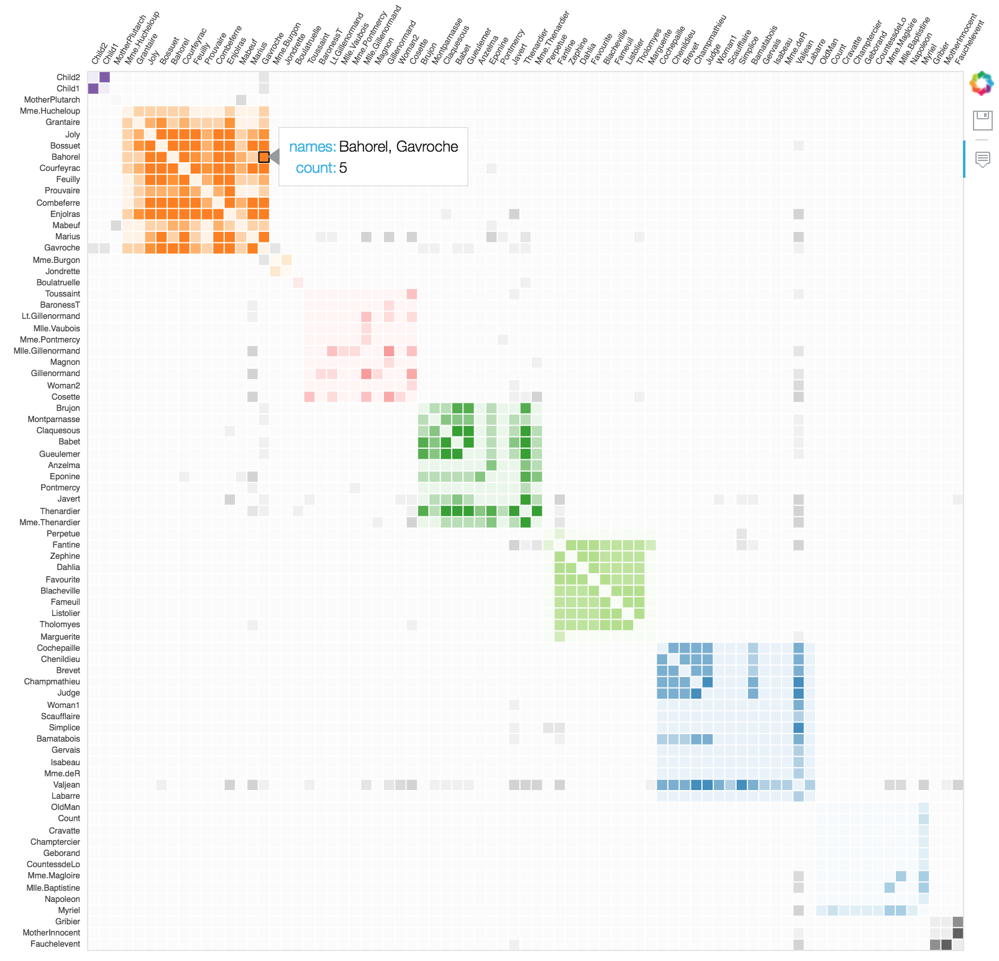

# Testing-Bokeh-Visualization

## Purpose

This project was made to test the Python module Bokeh.

## Results

I prefer the Seaborn, pandas, or matplotlib API.

i.e. df.plot(y="sheep")

## How to Use

1. git clone this project
		2. Run:

		virtualenv -p /usr/local/bin/python3.6 venv
		pip install -r requirements.txt
		source venv/bin/activate

3. Create a IPython Kernel for this venv (https://anbasile.github.io/programming/2017/06/25/jupyter-venv/)

4. Open the notebook with the command:

	      jupyter notebook

5. Run all the cells
